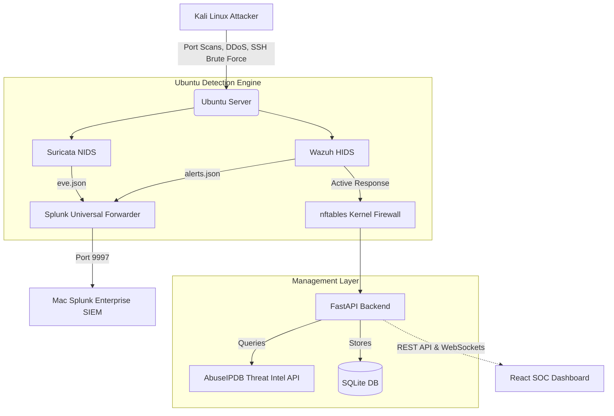

# 🛡️ Enterprise Security Operations Center (SOC) & Auto-Mitigation Firewall


## 📌 Project Overview
A complete, end-to-end Security Operations Center (SOC) and automated threat mitigation pipeline. This project simulates an enterprise security architecture, featuring network intrusion detection, host-based monitoring, automated firewall blocking, centralized SIEM logging, and a custom React web dashboard for manual intervention and live threat intelligence.

## 🏗️ Architecture



## 🚀 Features
- **Network IDS (Suricata)**: Detects port scans, SYN floods, and malware signatures.
- **Host IDS (Wazuh)**: Monitors `auth.log` for SSH brute force attacks and triggers Active Response scripts.
- **Auto-Mitigation**: Automatically drops malicious IPs at the kernel level using `nftables`.
- **SIEM Aggregation (Splunk)**: Centralized logging with custom XML dashboards for live threat hunting.
- **REST API (FastAPI)**: Python backend that synchronizes kernel-level firewall rules with an SQLite database.
- **Threat Intelligence**: Integrates with AbuseIPDB API to automatically score and locate attacking IP addresses.
- **SOC Web Dashboard (React)**: Premium glassmorphism UI to manually block IPs, unblock IPs, and monitor live attack metrics.

## 🛠️ Technology Stack
- **Infrastructure**: Ubuntu Server, Kali Linux, macOS
- **Cybersecurity**: Suricata, Wazuh, nftables, AbuseIPDB
- **Data & Logging**: Splunk Enterprise, Splunk Universal Forwarder
- **Backend Development**: Python, FastAPI, SQLAlchemy, SQLite
- **Frontend Development**: React, Vite, Vanilla CSS, Axios, Lucide-React

## 💻 Phases Completed

1. **Lab Networking**: Established secure routing and NAT between Kali, Ubuntu, and macOS.
2. **Suricata Implementation**: Deployed NIDS and wrote custom IDS rules to detect Nmap and DoS tools.
3. **Wazuh & Active Response**: Configured HIDS and wrote custom bash scripts to interface with `nftables` for immediate packet dropping.
4. **Splunk Integration**: Setup Universal Forwarder to ship Suricata `eve.json` and Wazuh `alerts.json` to Mac-based Splunk instance. Built 3 custom XML dashboards.
5. **FastAPI Development**: Built a complete Python REST API to act as the "brain", syncing OS-level firewall states into a relational database.
6. **React Dashboard**: Designed a high-performance web UI with zero-dependency CSS glassmorphism.
7. **Attack Simulation**: Built an automated Python script on Kali to systematically test the pipeline.

## 🛡️ Usage (Attack Simulation)
To test the auto-mitigation pipeline, run the simulator on Kali:
```bash
python3 attack_simulator.py
```
1. Select an attack vector (e.g., SSH Brute Force).
2. Wazuh detects the anomalous login attempts.
3. Wazuh triggers `nftables-block.sh`.
4. The IP is dropped at the kernel layer.
5. The FastAPI backend auto-syncs the new rule.
6. The React Dashboard automatically displays the new threat.

---
*Developed by Seetharam Damarla as a comprehensive portfolio project demonstrating Full-Stack Cybersecurity Engineering.*
