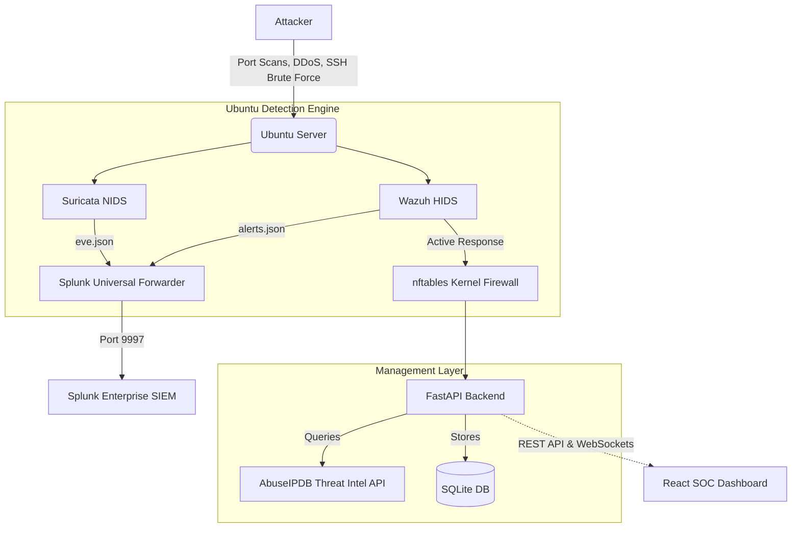

# Enterprise Security Operations Center (SOC) & Auto-Mitigation Firewall


## Live Demonstration
**[Watch the 3-Minute Video Demo Here](https://www.loom.com/share/439f958a10924b00896e354ad9a25c3b)** - *Shows live Kali Linux attacks being auto-mitigated and visualized on the 3D React Dashboard.*

## Project Overview
A complete, end-to-end Security Operations Center (SOC) and automated threat mitigation pipeline. This project simulates an enterprise security architecture, featuring network intrusion detection, host-based monitoring, automated firewall blocking, centralized SIEM logging, and a custom React web dashboard for manual intervention and live threat intelligence.

## Architecture



## Features
- **Network IDS (Suricata)**: Detects port scans, SYN floods, and malware signatures.
- **Host IDS (Wazuh)**: Monitors authentication logs for brute force attacks and triggers Active Response scripts.
- **Auto-Mitigation**: Automatically drops malicious IPs at the kernel level using `nftables`.
- **SIEM Aggregation (Splunk)**: Centralized logging with custom XML dashboards for live threat hunting.
- **REST API (FastAPI)**: Python backend that synchronizes kernel-level firewall rules with an SQLite database.
- **Threat Intelligence**: Integrates with the AbuseIPDB API to automatically score and locate attacking IP addresses.
- **SOC Web Dashboard (React)**: Professional enterprise-grade interface using Tailwind CSS and Framer Motion, featuring a highly realistic 3D WebGL Attack Origin Map with animated radar ping geolocation, and full manual threat mitigation controls.

## Technology Stack
- **Infrastructure**: Ubuntu Server, Kali Linux, macOS
- **Cybersecurity**: Suricata, Wazuh, nftables, AbuseIPDB
- **Data & Logging**: Splunk Enterprise, Splunk Universal Forwarder
- **Backend Development**: Python, FastAPI, SQLAlchemy, SQLite
- **Frontend Development**: React, Vite, Tailwind CSS, Framer Motion, React-Globe.GL (WebGL), Aceternity UI

## Implementation Phases

1. **Lab Networking**: Established secure routing and NAT between the attacker node, the target server, and the management host.
2. **Suricata Implementation**: Deployed NIDS and wrote custom IDS rules to detect reconnaissance and denial-of-service tools.
3. **Wazuh & Active Response**: Configured HIDS and wrote custom bash scripts to interface with `nftables` for immediate packet dropping upon detection.
4. **Splunk Integration**: Configured Universal Forwarder to ship Suricata and Wazuh logs to a centralized Splunk instance. Built targeted XML dashboards for analysis.
5. **FastAPI Development**: Built a complete Python REST API to synchronize OS-level firewall states into a relational database and expose management endpoints.
6. **React Dashboard**: Designed a clean, professional React application using Tailwind CSS and Framer Motion for incident responders to view metrics and manage firewall blocks in real-time, including a 3D Earth visualization.
7. **Attack Simulation**: Built an automated simulation suite to systematically test the pipeline under varying attack loads.

## Usage (Attack Simulation)
To test the auto-mitigation pipeline, execute the simulator script:
```bash
python3 attack_simulator.py
```
1. Select an attack vector (e.g., SSH Brute Force).
2. Wazuh detects the anomalous login attempts.
3. Wazuh triggers the active response script.
4. The IP is dropped at the kernel layer via `nftables`.
5. The FastAPI backend auto-syncs the new firewall rule.
6. The React Dashboard automatically displays the new threat metrics.

---
*Developed by Seetharam Damarla*

