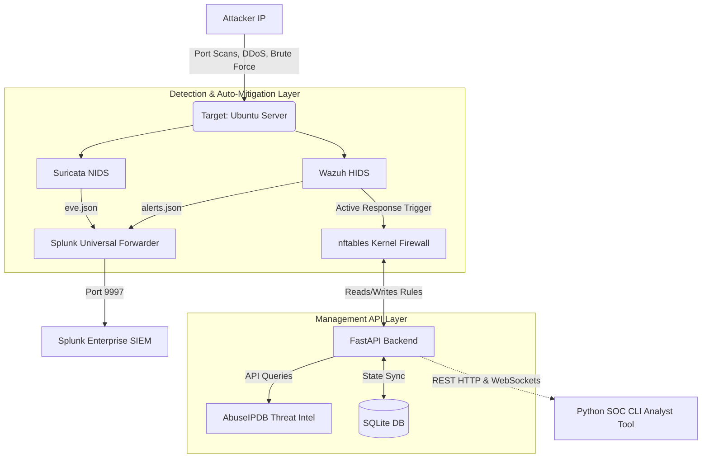

# Enterprise Security Operations Center (SOC) & Auto-Mitigation Pipeline


## Executive Summary
This project is an **end-to-end Security Operations Center (SOC) simulation and automated threat mitigation pipeline**. Designed to mimic real-world enterprise security architectures, it demonstrates the full lifecycle of cybersecurity defense: from identifying malicious network packets to automatically dropping the attacker at the Linux kernel level, culminating in real-time threat analysis via a custom Python Command-Line Interface (CLI).

**For Recruiters & Engineering Leaders:** 
This repository serves as a comprehensive demonstration of skills across **Cybersecurity Engineering** (IDS/IPS tuning, SIEM integration), **Systems Administration** (Linux networking, `nftables`), and **Software Engineering** (FastAPI backend development, WebSocket streaming, and Python CLI tooling).

---

## Core Capabilities
*   **Intrusion Detection (NIDS/HIDS):** Utilizes **Suricata** to detect network anomalies (SYN floods, malware signatures) and **Wazuh** to monitor host-level threats (SSH brute-force, privilege escalation).
*   **Kernel-Level Auto-Mitigation:** Wazuh Active Responses trigger custom shell scripts that immediately drop malicious IP addresses using Linux `nftables`—halting attacks in milliseconds.
*   **Centralized SIEM Logging:** All events are ingested by a Splunk Universal Forwarder and shipped to Splunk Enterprise for indexing and dashboard visualization.
*   **REST API Integration:** A high-performance Python **FastAPI** backend synchronizes the live OS firewall state with a persistent SQLite database.
*   **Threat Intelligence Enrichment:** Automatically queries the **AbuseIPDB API** to assign threat scores and geolocate attacking IPs.
*   **Real-Time CLI Dashboard:** A robust, visually appealing Python CLI (built with Typer & Rich) allows security analysts to manage blocks and stream live security alerts directly in the terminal via WebSockets.

---

## System Architecture


```mermaid
graph TD
    A[Attacker IP] -->|Port Scans, DDoS, Brute Force| B(Target: Ubuntu Server)
    
    subgraph Detection & Auto-Mitigation Layer
        B --> C[Suricata NIDS]
        B --> D[Wazuh HIDS]
        C -->|eve.json| E[Splunk Universal Forwarder]
        D -->|alerts.json| E
        D -->|Active Response Trigger| F[nftables Kernel Firewall]
    end
    
    subgraph Management API Layer
        F <-->|Reads/Writes Rules| G[FastAPI Backend]
        G -->|API Queries| H[AbuseIPDB Threat Intel]
        G <-->|State Sync| I[(SQLite DB)]
    end
    
    E -->|Port 9997| J[Splunk Enterprise SIEM]
    G -.->|REST HTTP & WebSockets| K[Python SOC CLI Analyst Tool]
```

---

## Technology Stack

| Category | Technologies Used |
| :--- | :--- |
| **Infrastructure** | Ubuntu Server (Defender), Kali Linux (Attacker), Linux Kernel Networking |
| **Security & SIEM** | Suricata, Wazuh, `nftables`, Splunk Enterprise |
| **Backend API** | Python 3, FastAPI, SQLAlchemy, SQLite, Uvicorn |
| **CLI & Tooling** | Python 3, Typer, Rich (Terminal UI), Requests, WebSockets |

---

## How It Works (The Threat Lifecycle)
1. **The Attack:** A Kali Linux machine runs an automated script simulating an SSH brute-force attack against the Ubuntu Server.
2. **Detection:** The Wazuh agent analyzes `/var/log/auth.log`, identifies the rapid authentication failures, and flags it as a Level 10 threat.
3. **Auto-Mitigation:** The Wazuh manager instantly triggers a local Active Response script, pushing an `nftables` rule to drop all incoming packets from the attacker's IP.
4. **Data Sync:** The FastAPI backend detects the new kernel-level block, saves the record to the SQLite database, and queries AbuseIPDB for threat context.
5. **Analyst Review:** A security engineer opens the **Python CLI**, runs `pf-cli list` to see the newly blocked IP, and runs `pf-cli monitor` to watch live alerts stream in.

---

## Deployment & Usage Guide

To run the management API and interact with the CLI locally, follow these steps. *(Note: Full kernel-level auto-mitigation requires deploying the `ubuntu-server` components on a Linux machine with `nftables`)*.

### 1. Start the Backend API
The backend acts as the bridge between the database, the threat intelligence API, and the firewall.
```bash
# Navigate to the backend directory
cd ubuntu-server/backend

# Install dependencies
pip install -r requirements.txt

# Start the FastAPI server (Runs on http://localhost:8000)
uvicorn main:app --host 127.0.0.1 --port 8000
```

### 2. Use the SOC CLI
Open a **new, separate terminal window** to run the CLI tool.

```bash
# Navigate to the CLI directory
cd cli

# Install CLI dependencies (Typer, Rich, etc.)
pip install -r requirements.txt
```

**Available CLI Commands:**
*   `python3 pf_cli.py status` : Ping the API to ensure the SOC backend is online.
*   `python3 pf_cli.py list` : Display a visually formatted table of all currently blocked malicious IPs.
*   `python3 pf_cli.py block <IP>` : Manually apply a block to a suspicious IP and retrieve its AbuseIPDB threat score.
*   `python3 pf_cli.py unblock <IP>` : Remove an IP from the blocklist.
*   `python3 pf_cli.py threat <IP>` : Query the threat intelligence score for a specific IP.
*   `python3 pf_cli.py monitor` : Connect to the WebSocket stream and watch real-time Suricata and Wazuh alerts print directly to your terminal.

---
*Architected and Developed by Seetharam Damarla*
