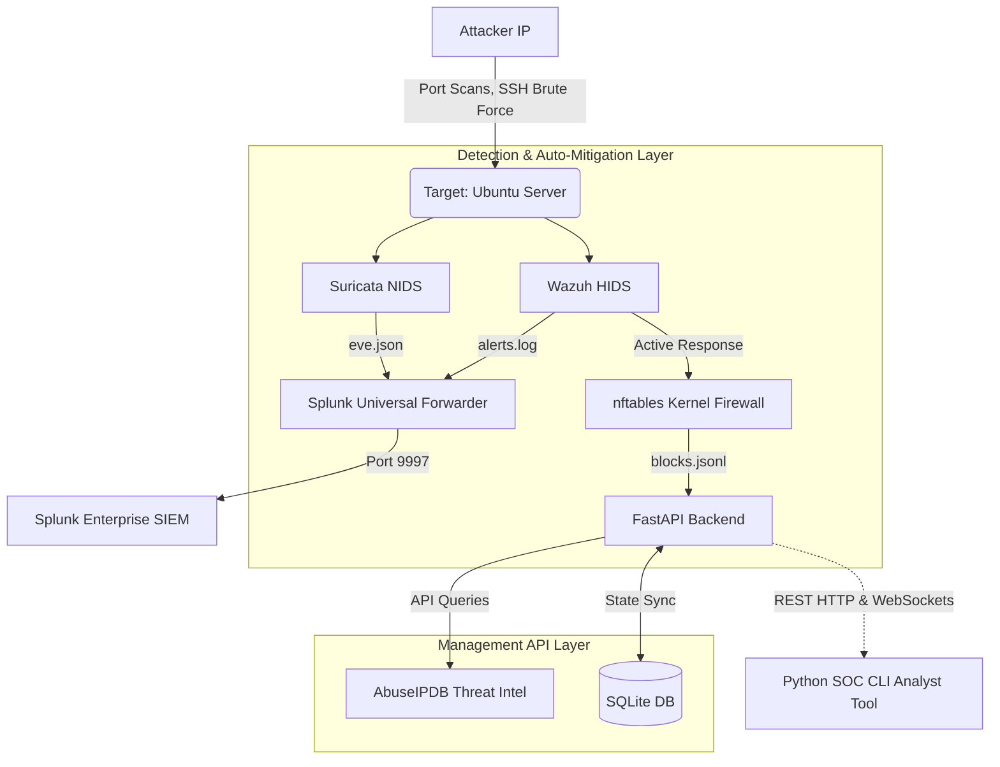

# Enterprise Security Operations Center (SOC) & Auto-Mitigation Pipeline


## Executive Summary
This project is an **end-to-end Security Operations Center (SOC) simulation and automated threat mitigation pipeline**. Designed to mimic real-world enterprise security architectures, it demonstrates the full lifecycle of cybersecurity defense: from identifying malicious network packets to automatically dropping the attacker at the Linux kernel level, culminating in real-time threat analysis via a custom Python Command-Line Interface (CLI).

**For Recruiters & Engineering Leaders:** 
This repository serves as a comprehensive demonstration of skills across **Cybersecurity Engineering** (IDS/IPS tuning, SIEM integration), **Systems Administration** (Linux networking, `nftables`), and **Software Engineering** (FastAPI backend development, asynchronous WebSocket streaming via `aiofiles`, and Python CLI tooling).

---

## Core Capabilities
*   **Intrusion Detection (NIDS/HIDS):** Utilizes **Suricata** to detect network anomalies (SYN floods, malware signatures) and **Wazuh** to monitor host-level threats (SSH brute-force, privilege escalation).
*   **Kernel-Level Auto-Mitigation:** Wazuh Active Responses trigger custom shell scripts that immediately drop malicious IP addresses using Linux `nftables`—halting attacks in milliseconds.
*   **Centralized SIEM Logging:** All events are ingested by a Splunk Universal Forwarder and shipped to Splunk Enterprise for indexing and dashboard visualization.
*   **REST API & WebSockets:** A high-performance Python **FastAPI** backend synchronizes the live OS firewall state with a persistent SQLite database and uses `aiofiles` to asynchronously stream OS-level block logs directly to connected clients.
*   **Threat Intelligence Enrichment:** Automatically queries the **AbuseIPDB API** to assign threat scores and geolocate attacking IPs.
*   **Real-Time CLI Dashboard:** A robust, visually appealing Python CLI (built with Typer & Rich) allows security analysts to manage blocks and stream live security alerts directly in the terminal.

---

## System Architecture


```mermaid
graph TD
    A[Attacker IP] -->|Port Scans, SSH Brute Force| B(Target: Ubuntu Server)
    
    subgraph Detection & Auto-Mitigation Layer
        B --> C[Suricata NIDS]
        B --> D[Wazuh HIDS]
        C -->|eve.json| E[Splunk Universal Forwarder]
        D -->|alerts.log| E
        D -->|Active Response| F[nftables Kernel Firewall]
        F -->|blocks.jsonl| G[FastAPI Backend]
    end
    
    subgraph Management API Layer
        G -->|API Queries| H[AbuseIPDB Threat Intel]
        G <-->|State Sync| I[(SQLite DB)]
    end
    
    E -->|Port 9997| J[Splunk Enterprise SIEM]
    G -.->|REST HTTP & WebSockets| K[Python SOC CLI Analyst Tool]
```

---

## Deployment & Usage Guide

### 1. Wazuh Auto-Mitigation Setup (Ubuntu Server)
To enable automated blocking, Wazuh must be configured with custom rules and the active response script:
```bash
# 1. Install custom SSH Brute-Force Rules
sudo cp ~/personal-firewall/ubuntu-server/wazuh/rules/personal-firewall.xml /var/ossec/etc/rules/
sudo chown wazuh:wazuh /var/ossec/etc/rules/personal-firewall.xml

# 2. Install the nftables blocking script
sudo cp ~/personal-firewall/ubuntu-server/wazuh/active-response/nftables-block.sh /var/ossec/active-response/bin/
sudo chmod 750 /var/ossec/active-response/bin/nftables-block.sh
sudo chown root:wazuh /var/ossec/active-response/bin/nftables-block.sh

# 3. Update /var/ossec/etc/ossec.conf to track auth.log and bind the Active Response command
# 4. Restart Wazuh
sudo systemctl restart wazuh-manager
```

### 2. Start the Backend API (Ubuntu Server)
The backend acts as the bridge between the database, the threat intelligence API, and the firewall.
```bash
cd ~/personal-firewall/ubuntu-server/backend
pip install -r requirements.txt

# Start the FastAPI server (Run with sudo to allow tailing of system log files)
sudo $(which uvicorn) main:app --host 0.0.0.0 --port 8000
```

### 3. Use the SOC CLI (Analyst Machine / Mac)
The Python CLI connects to the remote Ubuntu server to display threat intelligence and live alerts.

```bash
cd cli
pip install -r requirements.txt
```

**Available CLI Commands:**
*   `python3 pf_cli.py status` : Ping the API to ensure the SOC backend is online.
*   `python3 pf_cli.py list` : Display a visually formatted table of all currently blocked malicious IPs.
*   `python3 pf_cli.py block <IP>` : Manually apply a block to a suspicious IP and retrieve its AbuseIPDB threat score.
*   `python3 pf_cli.py unblock <IP>` : Remove an IP from the kernel blocklist.
*   `python3 pf_cli.py threat <IP>` : Query the threat intelligence score for a specific IP.
*   `python3 pf_cli.py monitor` : Connect to the WebSocket stream and watch real-time Suricata and Wazuh alerts print directly to your terminal.

### Developer Workflow
A `sync.sh` script is provided for rapid local development. It uses `rsync` to instantly push codebase changes from a local Mac to the Ubuntu server without overwriting sensitive `.env` files or virtual environments.

---
*Architected and Developed by Seetharam Damarla*
